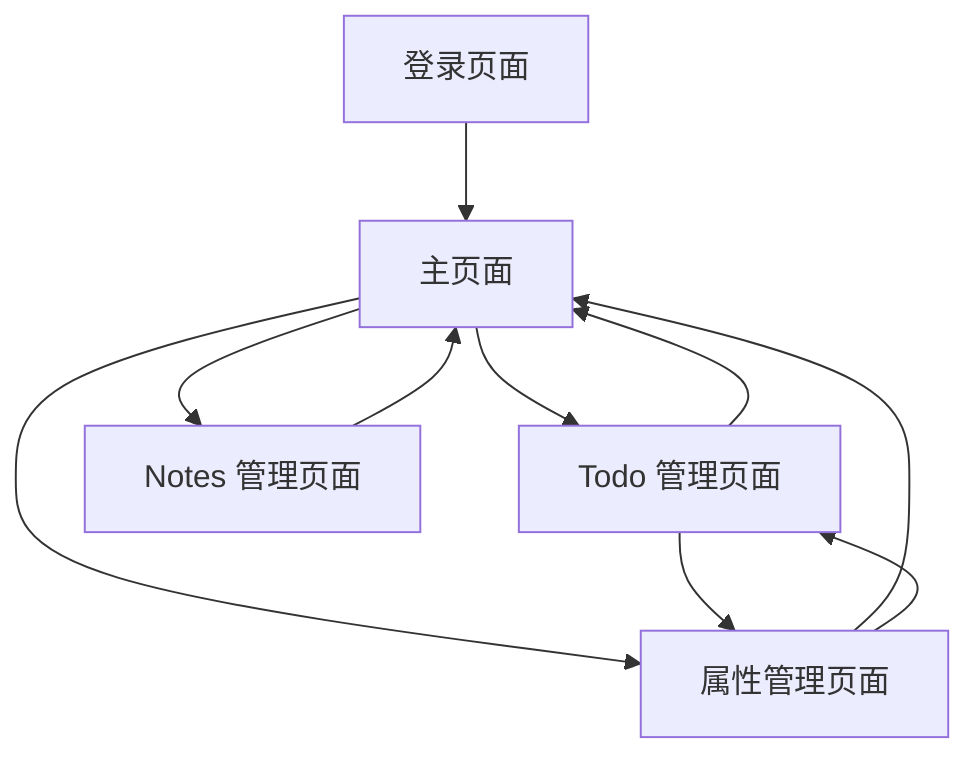

# Todo + Notes Manager 产品需求文档

## 1. Product Overview

Todo + Notes Manager 是一个个人使用的任务和笔记管理应用，帮助用户高效管理日常待办事项和记录重要笔记。
- 解决个人任务管理和笔记记录的需求，提供简洁易用的界面让用户专注于内容本身。
- 目标是成为轻量级的个人生产力工具，支持基本的 CRUD 操作和用户认证。

## 2. Core Features

### 2.1 User Roles

| Role | Registration Method | Core Permissions |
|------|---------------------|------------------|
| 注册用户 | 邮箱注册/登录 | 可以创建、查看、编辑、删除自己的 Todo 和 Notes |

### 2.2 Feature Module

我们的 Todo + Notes Manager 包含以下主要页面：
1. **登录页面**: 用户认证表单，支持注册和登录
2. **主页面**: 导航菜单，快速访问 Todo 和 Notes 功能
3. **Todo 管理页面**: Todo 列表展示，添加/编辑/删除 Todo 功能，属性标签管理
4. **Notes 管理页面**: Notes 列表展示，添加/编辑/删除 Notes 功能
5. **属性管理页面**: 创建和管理 Todo 属性标签（紧急、重要、长远等）

### 2.3 Page Details

| Page Name | Module Name | Feature description |
|-----------|-------------|---------------------|
| 登录页面 | 认证表单 | 提供邮箱和密码输入框，支持用户注册和登录，包含表单验证 |
| 主页面 | 导航菜单 | 显示应用标题，提供 Todo 和 Notes 的快速导航链接 |
| 主页面 | 概览统计 | 显示 Todo 总数、完成数量、Notes 总数等基本统计信息 |
| Todo 管理页面 | Todo 列表 | 展示所有 Todo 项目，支持按状态筛选（全部/待完成/已完成），按属性标签筛选 |
| Todo 管理页面 | Todo 操作 | 添加新 Todo、标记完成/未完成、编辑内容、删除 Todo、分配属性标签 |
| Todo 管理页面 | 属性标签显示 | 在 Todo 项目上显示已分配的属性标签，支持颜色区分不同属性 |
| 属性管理页面 | 属性列表 | 展示所有可用的属性标签，显示标签名称、颜色和使用统计 |
| 属性管理页面 | 属性操作 | 创建新属性标签、编辑属性名称和颜色、删除未使用的属性标签 |
| Notes 管理页面 | Notes 列表 | 展示所有笔记，支持按创建时间排序，显示标题和预览内容 |
| Notes 管理页面 | Notes 操作 | 创建新笔记、编辑笔记内容、删除笔记，支持富文本编辑 |

## 3. Core Process

**用户主要操作流程：**

1. 用户访问应用 → 登录/注册 → 进入主页面
2. 从主页面选择 Todo 管理、Notes 管理或属性管理
3. 在 Todo 页面：查看待办列表 → 添加新任务 → 为任务分配属性标签 → 标记完成状态 → 编辑或删除任务 → 按属性筛选任务
4. 在 Notes 页面：查看笔记列表 → 创建新笔记 → 编辑笔记内容 → 删除不需要的笔记
5. 在属性管理页面：查看所有属性标签 → 创建新属性（设置名称和颜色）→ 编辑现有属性 → 删除未使用的属性
6. 用户可以随时在不同功能间切换

## 4. User Interface Design

### 4.1 Design Style

- **主色调**: 蓝色系 (#3B82F6) 作为主色，灰色系 (#6B7280) 作为辅助色
- **按钮样式**: 圆角按钮，hover 效果，主要按钮使用蓝色背景
- **字体**: 系统默认字体，标题使用 18-24px，正文使用 14-16px
- **布局风格**: 卡片式布局，顶部导航栏，左侧可选菜单
- **图标风格**: 使用简洁的线性图标，支持添加、编辑、删除等操作图标
- **属性标签样式**: 圆角小标签，不同颜色背景区分属性类型，白色文字

### 4.2 Page Design Overview

| Page Name | Module Name | UI Elements |
|-----------|-------------|-------------|
| 登录页面 | 认证表单 | 居中卡片布局，白色背景，蓝色提交按钮，简洁的输入框设计 |
| 主页面 | 导航菜单 | 顶部导航栏，蓝色背景，白色文字，包含应用标题和用户信息 |
| 主页面 | 概览统计 | 网格布局的统计卡片，每个卡片显示数字和描述文字 |
| Todo 管理页面 | Todo 列表 | 列表项使用卡片样式，包含复选框、文字内容、属性标签和操作按钮 |
| Todo 管理页面 | 属性筛选 | 顶部筛选栏，显示所有可用属性标签，支持多选筛选 |
| 属性管理页面 | 属性列表 | 表格或卡片布局，显示属性名称、颜色预览、使用次数和操作按钮 |
| 属性管理页面 | 属性编辑 | 模态框或侧边栏，包含名称输入框和颜色选择器 |
| Notes 管理页面 | Notes 列表 | 网格布局的笔记卡片，显示标题、预览内容和创建时间 |

### 4.3 Responsiveness

应用采用移动端优先的响应式设计，在桌面端和移动端都能良好显示，支持触摸操作优化。