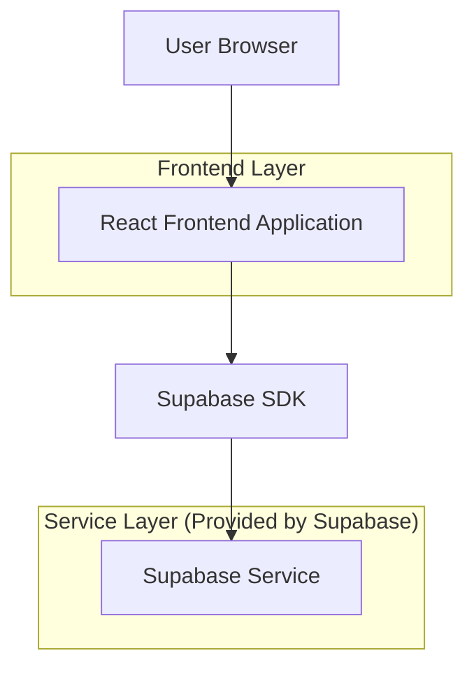
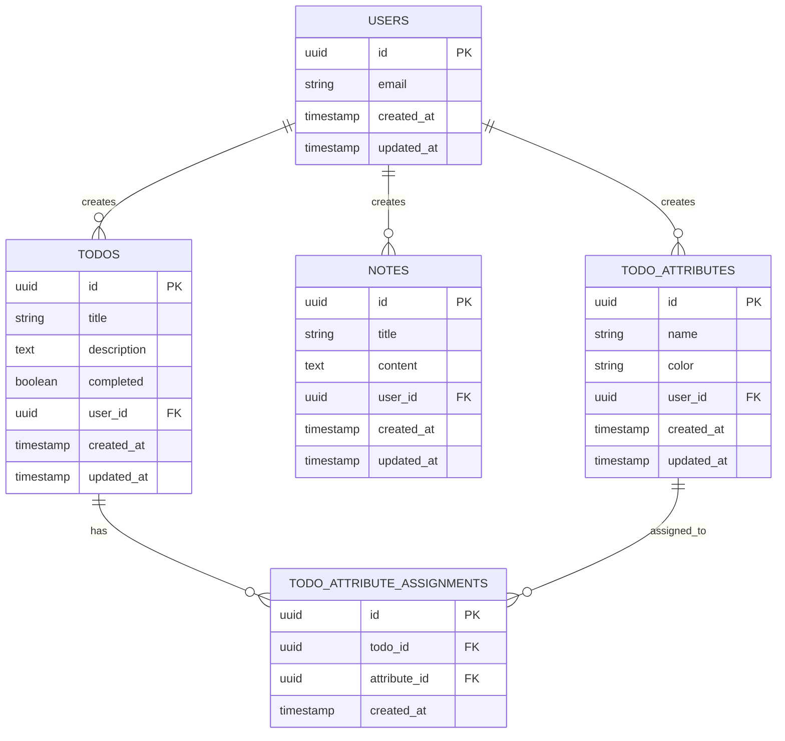

# Todo + Notes Manager 技术架构文档

## 1. Architecture design



## 2. Technology Description

* Frontend: React\@18 + TypeScript\@5 + Vite\@5 + TailwindCSS\@3

* Backend: Supabase (Authentication + PostgreSQL Database)

* Deployment: GitHub Pages (静态托管)

## 3. Route definitions

| Route  | Purpose             |
| ------ | ------------------- |
| /      | 主页面，显示应用概览和导航菜单     |
| /login | 登录页面，用户认证和注册        |
| /todos | Todo 管理页面，显示和管理待办事项 |
| /notes | Notes 管理页面，显示和管理笔记  |
| /attributes | 属性管理页面，管理 Todo 属性标签 |

## 4. API definitions

### 4.1 Core API

**用户认证相关 (通过 Supabase Auth)**

```typescript
// 登录
supabase.auth.signInWithPassword({
  email: string,
  password: string
})

// 注册
supabase.auth.signUp({
  email: string,
  password: string
})

// 登出
supabase.auth.signOut()
```

**Todo 相关操作**

```typescript
// 获取用户的所有 Todo
supabase.from('todos').select('*').eq('user_id', userId)

// 创建新 Todo
supabase.from('todos').insert({
  title: string,
  completed: boolean,
  user_id: string
})

// 更新 Todo
supabase.from('todos').update({
  title?: string,
  completed?: boolean
}).eq('id', todoId)

// 删除 Todo
supabase.from('todos').delete().eq('id', todoId)
```

**Notes 相关操作**

```typescript
// 获取用户的所有 Notes
supabase.from('notes').select('*').eq('user_id', userId)

// 创建新 Note
supabase.from('notes').insert({
  title: string,
  content: string,
  user_id: string
})

// 更新 Note
supabase.from('notes').update({
  title?: string,
  content?: string
}).eq('id', noteId)

// 删除 Note
supabase.from('notes').delete().eq('id', noteId)
```

**属性管理相关操作**

```typescript
// 获取用户的所有属性
supabase.from('todo_attributes').select('*').eq('user_id', userId)

// 创建新属性
supabase.from('todo_attributes').insert({
  name: string,
  color: string,
  user_id: string
})

// 更新属性
supabase.from('todo_attributes').update({
  name?: string,
  color?: string
}).eq('id', attributeId)

// 删除属性
supabase.from('todo_attributes').delete().eq('id', attributeId)

// 为 Todo 分配属性
supabase.from('todo_attribute_assignments').insert({
  todo_id: string,
  attribute_id: string
})

// 移除 Todo 的属性
supabase.from('todo_attribute_assignments').delete()
  .eq('todo_id', todoId)
  .eq('attribute_id', attributeId)

// 获取 Todo 及其属性
supabase.from('todos')
  .select(`
    *,
    todo_attribute_assignments(
      todo_attributes(*)
    )
  `)
  .eq('user_id', userId)
```

## 5. Data model

### 5.1 Data model definition



### 5.2 Data Definition Language

**Todos 表 (todos)**

```sql
-- 创建 todos 表
CREATE TABLE todos (
    id UUID PRIMARY KEY DEFAULT gen_random_uuid(),
    title VARCHAR(255) NOT NULL,
    description TEXT,
    completed BOOLEAN DEFAULT FALSE,
    user_id UUID REFERENCES auth.users(id) ON DELETE CASCADE,
    created_at TIMESTAMP WITH TIME ZONE DEFAULT NOW(),
    updated_at TIMESTAMP WITH TIME ZONE DEFAULT NOW()
);

-- 创建索引
CREATE INDEX idx_todos_user_id ON todos(user_id);
CREATE INDEX idx_todos_created_at ON todos(created_at DESC);

-- 设置权限
GRANT SELECT ON todos TO anon;
GRANT ALL PRIVILEGES ON todos TO authenticated;

-- 启用 RLS (Row Level Security)
ALTER TABLE todos ENABLE ROW LEVEL SECURITY;

-- 创建 RLS 策略
CREATE POLICY "Users can only see their own todos" ON todos
    FOR ALL USING (auth.uid() = user_id);
```

**Notes 表 (notes)**

```sql
-- 创建 notes 表
CREATE TABLE notes (
    id UUID PRIMARY KEY DEFAULT gen_random_uuid(),
    title VARCHAR(255) NOT NULL,
    content TEXT,
    user_id UUID REFERENCES auth.users(id) ON DELETE CASCADE,
    created_at TIMESTAMP WITH TIME ZONE DEFAULT NOW(),
    updated_at TIMESTAMP WITH TIME ZONE DEFAULT NOW()
);

-- 创建索引
CREATE INDEX idx_notes_user_id ON notes(user_id);
CREATE INDEX idx_notes_created_at ON notes(created_at DESC);

-- 设置权限
GRANT SELECT ON notes TO anon;
GRANT ALL PRIVILEGES ON notes TO authenticated;

-- 启用 RLS (Row Level Security)
ALTER TABLE notes ENABLE ROW LEVEL SECURITY;

-- 创建 RLS 策略
CREATE POLICY "Users can only see their own notes" ON notes
    FOR ALL USING (auth.uid() = user_id);
```

**Todo 属性表 (todo_attributes)**

```sql
-- 创建 todo_attributes 表
CREATE TABLE todo_attributes (
    id UUID PRIMARY KEY DEFAULT gen_random_uuid(),
    name VARCHAR(100) NOT NULL,
    color VARCHAR(7) NOT NULL, -- 十六进制颜色代码
    user_id UUID REFERENCES auth.users(id) ON DELETE CASCADE,
    created_at TIMESTAMP WITH TIME ZONE DEFAULT NOW(),
    updated_at TIMESTAMP WITH TIME ZONE DEFAULT NOW()
);

-- 创建索引
CREATE INDEX idx_todo_attributes_user_id ON todo_attributes(user_id);
CREATE UNIQUE INDEX idx_todo_attributes_user_name ON todo_attributes(user_id, name);

-- 设置权限
GRANT SELECT ON todo_attributes TO anon;
GRANT ALL PRIVILEGES ON todo_attributes TO authenticated;

-- 启用 RLS
ALTER TABLE todo_attributes ENABLE ROW LEVEL SECURITY;

-- 创建 RLS 策略
CREATE POLICY "Users can only see their own attributes" ON todo_attributes
    FOR ALL USING (auth.uid() = user_id);
```

**Todo 属性关联表 (todo_attribute_assignments)**

```sql
-- 创建 todo_attribute_assignments 表
CREATE TABLE todo_attribute_assignments (
    id UUID PRIMARY KEY DEFAULT gen_random_uuid(),
    todo_id UUID REFERENCES todos(id) ON DELETE CASCADE,
    attribute_id UUID REFERENCES todo_attributes(id) ON DELETE CASCADE,
    created_at TIMESTAMP WITH TIME ZONE DEFAULT NOW()
);

-- 创建索引
CREATE INDEX idx_todo_attr_assign_todo_id ON todo_attribute_assignments(todo_id);
CREATE INDEX idx_todo_attr_assign_attr_id ON todo_attribute_assignments(attribute_id);
CREATE UNIQUE INDEX idx_todo_attr_assign_unique ON todo_attribute_assignments(todo_id, attribute_id);

-- 设置权限
GRANT SELECT ON todo_attribute_assignments TO anon;
GRANT ALL PRIVILEGES ON todo_attribute_assignments TO authenticated;

-- 启用 RLS
ALTER TABLE todo_attribute_assignments ENABLE ROW LEVEL SECURITY;

-- 创建 RLS 策略
CREATE POLICY "Users can only see assignments for their todos" ON todo_attribute_assignments
    FOR ALL USING (
        EXISTS (
            SELECT 1 FROM todos 
            WHERE todos.id = todo_attribute_assignments.todo_id 
            AND todos.user_id = auth.uid()
        )
    );
```

**触发器 (自动更新 updated\_at)**

```sql
-- 创建更新时间戳函数
CREATE OR REPLACE FUNCTION update_updated_at_column()
RETURNS TRIGGER AS $$
BEGIN
    NEW.updated_at = NOW();
    RETURN NEW;
END;
$$ language 'plpgsql';

-- 为 todos 表创建触发器
CREATE TRIGGER update_todos_updated_at
    BEFORE UPDATE ON todos
    FOR EACH ROW
    EXECUTE FUNCTION update_updated_at_column();

-- 为 notes 表创建触发器
CREATE TRIGGER update_notes_updated_at
    BEFORE UPDATE ON notes
    FOR EACH ROW
    EXECUTE FUNCTION update_updated_at_column();

-- 为 todo_attributes 表创建触发器
CREATE TRIGGER update_todo_attributes_updated_at
    BEFORE UPDATE ON todo_attributes
    FOR EACH ROW
    EXECUTE FUNCTION update_updated_at_column();
```

