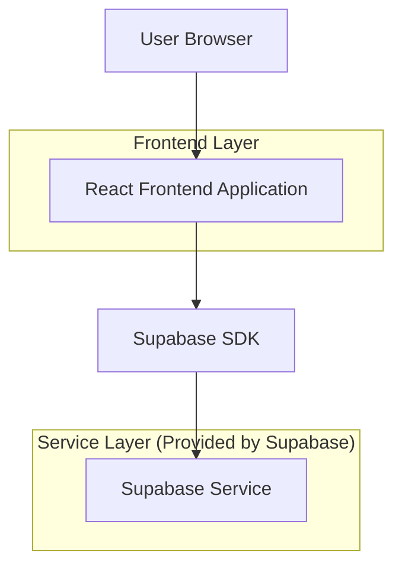
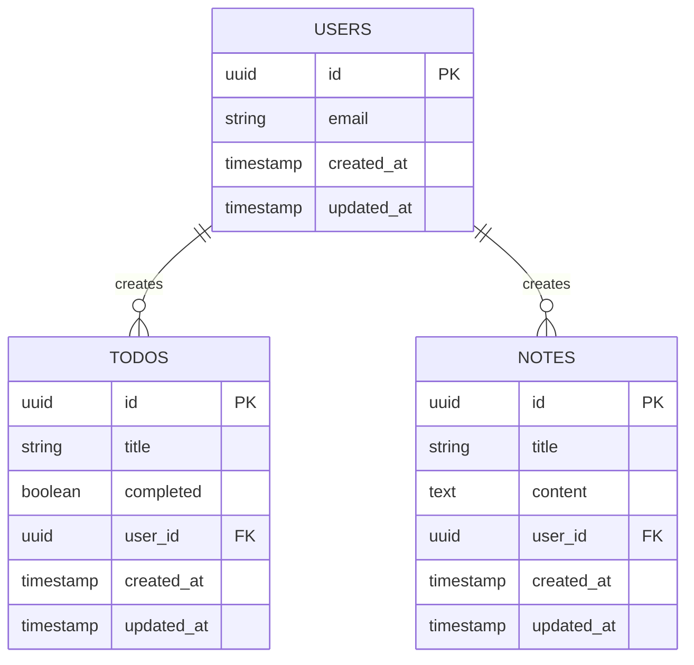

# Todo + Notes Manager 技术架构文档

## 1. Architecture design



## 2. Technology Description

* Frontend: React\@18 + TypeScript\@5 + Vite\@5 + TailwindCSS\@3

* Backend: Supabase (Authentication + PostgreSQL Database)

* Deployment: GitHub Pages (静态托管)

## 3. Route definitions

| Route  | Purpose             |
| ------ | ------------------- |
| /      | 主页面，显示应用概览和导航菜单     |
| /login | 登录页面，用户认证和注册        |
| /todos | Todo 管理页面，显示和管理待办事项 |
| /notes | Notes 管理页面，显示和管理笔记  |

## 4. API definitions

### 4.1 Core API

**用户认证相关 (通过 Supabase Auth)**

```typescript
// 登录
supabase.auth.signInWithPassword({
  email: string,
  password: string
})

// 注册
supabase.auth.signUp({
  email: string,
  password: string
})

// 登出
supabase.auth.signOut()
```

**Todo 相关操作**

```typescript
// 获取用户的所有 Todo
supabase.from('todos').select('*').eq('user_id', userId)

// 创建新 Todo
supabase.from('todos').insert({
  title: string,
  completed: boolean,
  user_id: string
})

// 更新 Todo
supabase.from('todos').update({
  title?: string,
  completed?: boolean
}).eq('id', todoId)

// 删除 Todo
supabase.from('todos').delete().eq('id', todoId)
```

**Notes 相关操作**

```typescript
// 获取用户的所有 Notes
supabase.from('notes').select('*').eq('user_id', userId)

// 创建新 Note
supabase.from('notes').insert({
  title: string,
  content: string,
  user_id: string
})

// 更新 Note
supabase.from('notes').update({
  title?: string,
  content?: string
}).eq('id', noteId)

// 删除 Note
supabase.from('notes').delete().eq('id', noteId)
```

## 5. Data model

### 5.1 Data model definition



### 5.2 Data Definition Language

**Todos 表 (todos)**

```sql
-- 创建 todos 表
CREATE TABLE todos (
    id UUID PRIMARY KEY DEFAULT gen_random_uuid(),
    title VARCHAR(255) NOT NULL,
    completed BOOLEAN DEFAULT FALSE,
    user_id UUID REFERENCES auth.users(id) ON DELETE CASCADE,
    created_at TIMESTAMP WITH TIME ZONE DEFAULT NOW(),
    updated_at TIMESTAMP WITH TIME ZONE DEFAULT NOW()
);

-- 创建索引
CREATE INDEX idx_todos_user_id ON todos(user_id);
CREATE INDEX idx_todos_created_at ON todos(created_at DESC);

-- 设置权限
GRANT SELECT ON todos TO anon;
GRANT ALL PRIVILEGES ON todos TO authenticated;

-- 启用 RLS (Row Level Security)
ALTER TABLE todos ENABLE ROW LEVEL SECURITY;

-- 创建 RLS 策略
CREATE POLICY "Users can only see their own todos" ON todos
    FOR ALL USING (auth.uid() = user_id);
```

**Notes 表 (notes)**

```sql
-- 创建 notes 表
CREATE TABLE notes (
    id UUID PRIMARY KEY DEFAULT gen_random_uuid(),
    title VARCHAR(255) NOT NULL,
    content TEXT,
    user_id UUID REFERENCES auth.users(id) ON DELETE CASCADE,
    created_at TIMESTAMP WITH TIME ZONE DEFAULT NOW(),
    updated_at TIMESTAMP WITH TIME ZONE DEFAULT NOW()
);

-- 创建索引
CREATE INDEX idx_notes_user_id ON notes(user_id);
CREATE INDEX idx_notes_created_at ON notes(created_at DESC);

-- 设置权限
GRANT SELECT ON notes TO anon;
GRANT ALL PRIVILEGES ON notes TO authenticated;

-- 启用 RLS (Row Level Security)
ALTER TABLE notes ENABLE ROW LEVEL SECURITY;

-- 创建 RLS 策略
CREATE POLICY "Users can only see their own notes" ON notes
    FOR ALL USING (auth.uid() = user_id);
```

**触发器 (自动更新 updated\_at)**

```sql
-- 创建更新时间戳函数
CREATE OR REPLACE FUNCTION update_updated_at_column()
RETURNS TRIGGER AS $$
BEGIN
    NEW.updated_at = NOW();
    RETURN NEW;
END;
$$ language 'plpgsql';

-- 为 todos 表创建触发器
CREATE TRIGGER update_todos_updated_at
    BEFORE UPDATE ON todos
    FOR EACH ROW
    EXECUTE FUNCTION update_updated_at_column();

-- 为 notes 表创建触发器
CREATE TRIGGER update_notes_updated_at
    BEFORE UPDATE ON notes
    FOR
```

